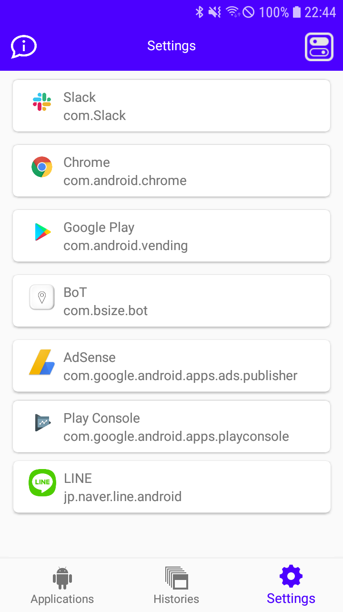
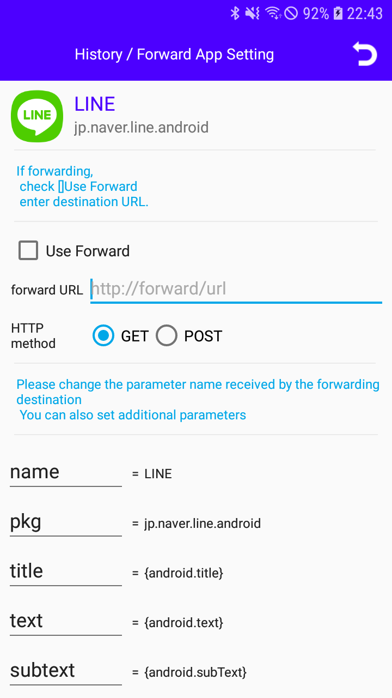
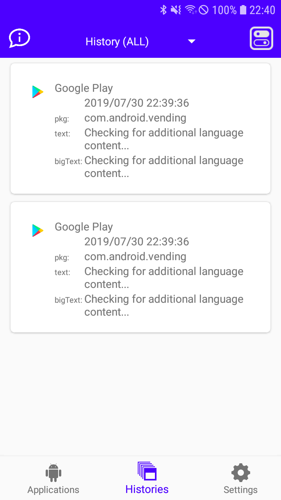
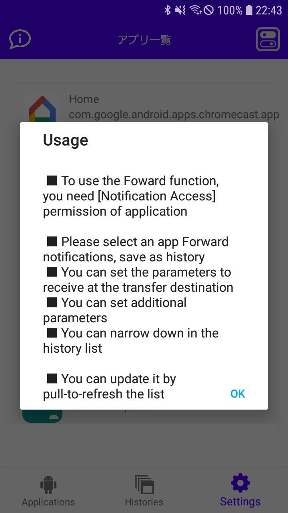
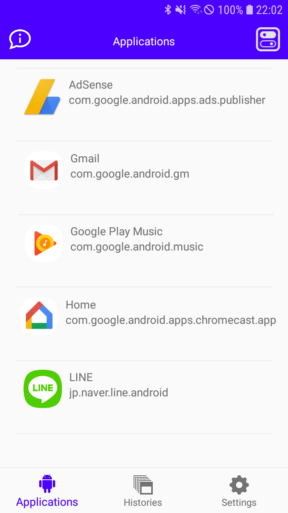
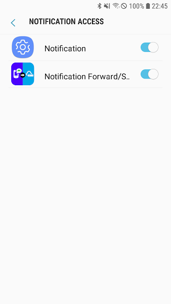

# Push Notification Forward HTTP

<p>

</p>

It is an application that saves push notification as HTTP {S} forwarding / history

<p>
<a href="https://play.google.com/store/apps/details?id=com.jojoagogogo.nf">

</a>

<a href="https://github.com/jojoagogogo/push-notification-forward/releases/latest/download/push-notification-forward.apk">

</a>

</p>

<p>







</p>

## Push Notification Forward HTTP

```

It is an application that saves push notification as HTTP {S} forwarding / history

The data received in the notification
You can HTTP POST GET to the configured url!

■ You need [Access to notification] permission of this application to use transfer function

■ Forward notifications, select the app to save as history

■ You can set the parameters to receive at the transfer destination

■ You can set additional parameters

■ You can narrow down in the history list

■ You can update it by pull-to-refresh the list

Example your server


<?php

$name = $_GET["name"];
$pkg = $_GET["pkg"];
$title = $_GET["title"];
$text = $_GET["text"];
$subtext = $_GET["subtext"];
$bigtext = $_GET["bigtext"];
$infotext = $_GET["infotext"];

$message = "";

if($pkg=="com.sample.app"){
$message = "from sample app {$title} ${text} ";
} else {
$message = "{$title} !! ${text} ";
}

$cmd = "/usr/bin/curl -X POST -d \"text=" . $message . "\" http://sample.com/to_sample";
$ret = exec($cmd);

echo $ret;

?>

```

## プッシュ通知転送 HTTP{S} / 履歴保存 アプリ

```
プッシュ通知を HTTP{S}転送 / 通知を履歴として保存するアプリです

■ 転送機能のご使用には本アプリの [通知へのアクセス]権限が必要です

■ 通知を転送、履歴として保存するアプリを選択して下さい

■ 転送先で受け取るパラメータを設定できます

■ 追加のパラメータを設定できます

■ 履歴一覧で絞り込みができます

■ リストを引っ張ると最新の状態に更新できます


サーバーでの設定例

<?php

$name = $_GET["name"];
$pkg = $_GET["pkg"];
$title = $_GET["title"];
$text = $_GET["text"];
$subtext = $_GET["subtext"];
$bigtext = $_GET["bigtext"];
$infotext = $_GET["infotext"];

$message = "";

if($pkg=="com.sample.app"){
$message = "from sample app {$title} ${text} ";
} else {
$message = "{$title} !! ${text} ";
}

$cmd = "/usr/bin/curl -X POST -d \"text=" . $message . "\" http://sample.com/to_sample";
$ret = exec($cmd);

echo $ret;

?>
```
